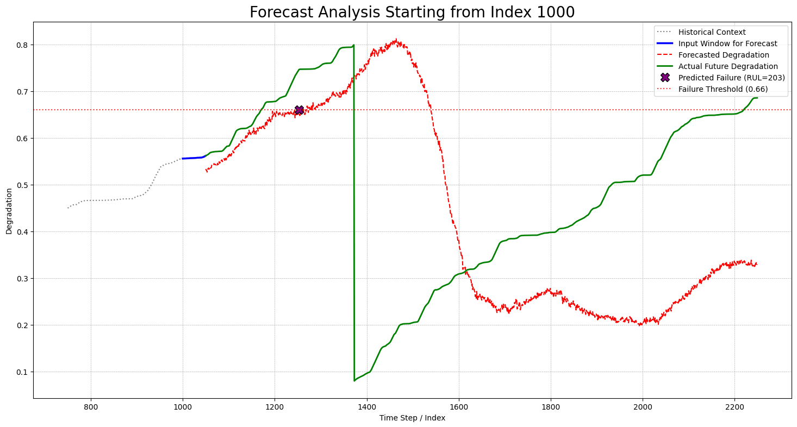

# ⚙️ Predictive Maintenance Dashboard for Wind Turbines

This repository contains the complete end-to-end pipeline for a **predictive maintenance solution** designed for wind turbine generators. It includes model development, training, and an interactive dashboard for real-time health forecasting of turbine components.

---

## 📌 Project Motivation

The primary goal is to **predict the Remaining Useful Life (RUL)** of wind turbine components using multivariate time series forecasting. By doing so, maintenance becomes proactive rather than reactive—reducing operational costs and preventing unexpected failures.

---

## 🚀 Key Features

- **Model Development:**  
  A detailed walkthrough in [`time_series_model_final.ipynb`](./NoteBook&DATA/time_series_model_final.ipynb) covering preprocessing, feature engineering, and training a BiLSTM-based Direct Multi-Step Forecasting model.

- **Interactive Streamlit Dashboard:**  
  [`app.py`](./Dashboard_App/app.py) enables users to:
  - Forecast future degradation curves and calculate RUL.
  - Visualize predicted vs actual sensor data.
  - Forecast multiple health indicators like temperature, vibration, etc.

- **Efficient Inference:**  
  The BiLSTM model predicts up to 1200 steps ahead in a single forward pass.

---

## 📊 Dashboard Demonstrations

### 🔧 RUL Prediction & Maintenance Forecast

_Visual showing degradation curve with predicted RUL point_  
**Image Placeholder:**  

---

### 🌡️ Component Health Forecasting Window

_Example of forecasting temperature and other features for the next 100 time steps_  
**Image Placeholder:**  

---

## 🗂️ Repository Structure

